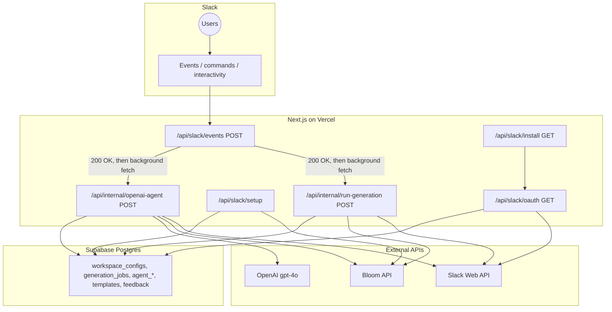

# Bloom Slack AI Agent — Technical Guide & Interview Prep

This document describes the **Bloom Slack** integration: product behavior, system architecture, data flows, security, and trade-offs. It mirrors the implementation in this repository (primarily `bloom-slack-nextjs/` plus `supabase/migrations/`).

---

## 1. Product spec (what it does)

**Bloom Slack** is a Slack application that connects a workspace to **Bloom** (trybloom.ai image generation API) so marketing teams can:

- **Mention the bot** (`@Bloom`) in a channel to have a **conversational agent** (OpenAI `gpt-4o`) interpret intent, clarify briefly, list recent Bloom images, or kick off **image generations** with platform-appropriate aspect ratios.
- **Continue the conversation in the thread** — replies in an existing agent thread are routed back to the same persisted conversation.
- Use the **`/bloom-gen`** slash command for structured operations: help, setup, generate, brand info, list images/credits/workspaces, etc.
- Receive **Block Kit** messages with loading states, multi-variant carousels (prev/next), **regenerate**, **intent refinement** buttons (premium, brighter, product, holiday), **thumbs up/down** feedback, and download links.

**Non-goals / constraints in the current codebase:**

- No Socket Mode; everything is **HTTP** (Slack Events API + slash commands + interactivity on one POST endpoint).
- **Secrets** (Slack bot token, Bloom API key) are stored in **Supabase** `workspace_configs`, not in Slack’s state.
- The agent does **not** hold image bytes in context; listing images always hits the **Bloom REST API**.

---

## 2. High-level architecture

If the diagram below does not render (some editors only show Mermaid in preview mode or on GitHub), use the **ASCII version** under it.



**ASCII (same architecture):**

```
                    ┌─────────────────────────────────────────┐
                    │                 Slack                    │
                    │  Users → Events / commands / buttons    │
                    └────────────────────┬────────────────────┘
                                         │
                                         ▼
                    ┌─────────────────────────────────────────┐
                    │         Next.js (e.g. Vercel)            │
                    │  POST /api/slack/events  (verify, ack)   │
                    │       │                                  │
                    │       ├── after() → openai-agent         │
                    │       └── after() → run-generation       │
                    │  GET install / oauth / setup routes      │
                    └───────┬─────────────────────┬────────────┘
                            │                     │
              ┌─────────────┴────────────┐        │
              ▼                          ▼        ▼
     ┌─────────────────┐      ┌──────────────┐  ┌─────────────┐
     │ Supabase Postgres│      │ OpenAI + Bloom│  │ Slack Web  │
     │ workspace_configs│      │ (generate)   │  │ chat.post… │
     │ generation_jobs  │      └──────────────┘  └─────────────┘
     │ agent_* , feedback
     └─────────────────┘
```

**Runtime split:**

| Concern | Where it runs |
|--------|----------------|
| Slack signature verification, fast ACK | `POST /api/slack/events` |
| Long OpenAI + Bloom + Slack posting | `/api/internal/openai-agent` |
| Long polling Bloom until images ready | `/api/internal/run-generation` (`maxDuration = 300`) |
| Durable state | Supabase Postgres |

---

## 3. Major components

### 3.1 Next.js app (`bloom-slack-nextjs/`)

- **Slack ingress:** `app/api/slack/events/route.ts` — verifies `x-slack-signature` + timestamp (`lib/utils.ts`), delegates to `handleSlackEventsPost` (`lib/slack-events-handler.ts`).
- **OAuth:** `app/api/slack/install/route.ts` → Slack authorize URL; `app/api/slack/oauth/route.ts` + `lib/slack-oauth.ts` — exchanges code, upserts `workspace_configs`, DMs installer a setup link.
- **Bloom brand setup:** `app/api/slack/setup/*` + `lib/slack-setup-html.ts` / `slack-setup-brands.ts` — web UI gated by `setup_token`.
- **Internal jobs:** Bearer `SUPABASE_SERVICE_ROLE_KEY` (`lib/internal-auth.ts`).

### 3.2 Core libraries

| File | Responsibility |
|------|----------------|
| `lib/slack-events-handler.ts` | URL verification, `app_mention` / threaded `message` dispatch, slash command `/bloom-gen`, Block Kit actions |
| `lib/openai-agent-handler.ts` | Conversation CRUD, `runAgent`, list-images path, enqueue generation jobs |
| `lib/run-generation-handler.ts` | Bloom generate vs edit-intent, poll until URLs, reorder variants by feedback bias, update Slack message |
| `lib/agent.ts` | OpenAI call, JSON schema-ish system prompt, `AgentDecision` parsing |
| `lib/bloom.ts` | Bloom HTTP client (`x-api-key`), generations, edits, polling, reference image selection |
| `lib/slack.ts` | `slackApi`, Block builders, `truncateSlackMrkdwn` |
| `lib/db.ts` | Supabase reads/writes for all tables |
| `lib/schedule-background-fetch.ts` | `after()` from `next/server` — **critical on Vercel** so fire-and-forget `fetch` after returning 200 actually runs |

### 3.3 Data store (migrations `001`–`004`)

- **`workspace_configs`:** per Slack `team_id` — `bot_token`, `bloom_api_key`, `brand_id` / `brand_name` / `brand_session_id`, `setup_token`, `setup_completed`, installer metadata.
- **`generation_jobs`:** async job rows — prompt, ratio, variants, `message_ts` (Slack message to update), `thread_ts`, `status`, `image_ids` / `image_urls`, `source_image_id` + `intent` for edits.
- **`prompt_templates` + `image_feedback` + `variant_feedback_stats`:** usage/win tracking and per-variant score bias for ordering.
- **`agent_conversations` + `agent_messages`:** thread-keyed chat history and `campaign_context` JSON for the agent.

---

## 4. End-to-end flows

### 4.1 Install & configure Bloom

1. User opens `GET /api/slack/install` → Slack OAuth.
2. `GET /api/slack/oauth?code=…` → `oauth.v2.access` → upsert `workspace_configs` (preserve existing Bloom fields on reinstall), new `setup_token`, DM with `…/api/slack/setup?token=…`.
3. User submits Bloom API key + brand on setup page → validates against Bloom → `completeSetup` / `updateWorkspaceBrand`.

**Alternate:** `/bloom-gen setup <api_key> [brand_id]` validates key, resolves brand, `saveWorkspaceConfig`.

### 4.2 `@Bloom` app mention → agent → optional generation

1. Slack POST JSON `event_callback` → signature OK → **immediate HTTP 200** (empty body).
2. `scheduleBackgroundFetch('openai-agent', …)` posts JSON to `/api/internal/openai-agent` with `Authorization: Bearer <service_role_key>`.
3. Handler loads `workspace_configs`, ensures Bloom key exists (else setup URL in thread).
4. `getOrCreateConversation(team, channel, thread_ts)` — for a mention, `replyThreadTs = thread_ts || message_ts` (root mention uses the mention message as thread parent).
5. Last **20** messages loaded; user message appended for the model; **`runAgent`** → structured `AgentDecision`.
6. Branches:
   - **`switch_brand`:** message + button → setup URL.
   - **`list_images`:** Bloom `listImages` with fallback query strategies; Slack mrkdwn list; truncate for Slack limits.
   - **`none` / `clarify`:** post assistant text only.
   - **`generate` / `generate_multiple`:** post status, `updateCampaignContext`, for each generation create `generation_jobs` row + `scheduleBackgroundFetch('run-generation', …)`.

### 4.3 Thread reply (no new `@mention`)

- Only `message` events with `thread_ts` are considered.
- `getConversationByThread` must find a row — **so only threads that already have an `agent_conversations` row** (created on first mention or first handler run for that thread) receive agent processing. Practically: user must have started via mention (or another path that created the conversation) before thread-only replies work.

### 4.4 `/bloom-gen generate …`

1. Ephemeral or channel responses per subcommand; for `generate`, posts **loading blocks** to channel (or slash command’s `thread_ts` if present).
2. `createJob`, `upsertPromptTemplate` (usage), `scheduleBackgroundFetch` to `run-generation`.

### 4.5 `run-generation` (internal)

1. Load job + workspace; resolve `brand_session_id || brand_id` for Bloom.
2. If no `message_ts`, posts request + progress messages and saves ts to job.
3. **Edit path:** if `intent` + `baseImageId` (from interactive payload), `editImage` + poll single id, splice URL into existing variant index.
4. **Generate path:** `generateImages` (includes **reference image IDs** from recent Bloom images for brand consistency) → poll all → **`reorderByFeedbackBias`** using `variant_feedback_stats` → `buildResultBlocks` → `chat.update`.
5. On failure: job `failed`, error blocks on Slack.

### 4.6 Block Kit interactions

- Payload arrives as `application/x-www-form-urlencoded` with `payload` JSON.
- Prev/next: updates job `current_image_index`, `chat.update` with new image block.
- Regenerate: new job, same prompt/meta, new background fetch.
- Intent buttons: new job with `source_image_id`, `intent`, copies prior `image_ids`/`image_urls` for in-place splice after edit.
- Feedback: upsert `image_feedback` + `variant_feedback_stats`; ephemeral confirmation; thumbs-up also **`upsertPromptTemplate(..., won: true)`**.

---

## 5. Slack app configuration (external)

- **Events URL:** `POST /api/slack/events` — `url_verification` returns `challenge`.
- **Bot token scopes** (must match `install/route.ts`): `app_mentions:read`, `channels:history`, `chat:write`, `commands`, `groups:history`, `im:write`.
- **Events:** `app_mention`, `message.channels` (and `message.groups` for private channels).
- **Slash command** `/bloom-gen` and **Interactivity** both point at the same Request URL as Events.

---

## 6. Security & operations

| Topic | Implementation |
|-------|------------------|
| Slack authenticity | HMAC-SHA256 `v0:{timestamp}:{rawBody}` vs `x-slack-signature`; reject stale timestamps (>5 min skew) |
| Internal routes | `Authorization: Bearer ${SUPABASE_SERVICE_ROLE_KEY}` — **treat service role as root access to DB** |
| Secrets in DB | `bot_token`, `bloom_api_key` in Postgres — protect Supabase keys; RLS policies exist but app uses **service role** (bypasses RLS) |
| PII | Slack user ids, prompts, generated image metadata stored in DB |
| Bloom | `x-api-key` header to `https://www.trybloom.ai/api/v1` |

**Operational note:** `NEXT_PUBLIC_APP_URL` (or `VERCEL_URL`) must match what Slack calls; OAuth redirect must **exactly** match Slack app settings.

---

## 7. Key design decisions (good interview soundbites)

1. **Ack fast, work async:** Slack requires a response within ~3 seconds. Heavy work is deferred via `after()`-scheduled self-HTTP to internal routes with extended `maxDuration` for generation polling.
2. **Single events endpoint:** Simplifies Slack configuration; content-type switches JSON vs form body.
3. **Structured agent output:** `response_format: json_object` + strict allowed `action` values reduces fragile string parsing.
4. **Feedback-driven variant ordering:** Aggregates votes per `(team, brand, image_index)` to sort variants before showing results.
5. **Reference images on generate:** Pulls up to 3 recent image IDs for the brand session to steer Bloom’s `generations` API toward on-brand output.
6. **Thread = conversation key:** `(team_id, channel_id, thread_ts)` uniqueness maps Slack threading to agent state cleanly.

---

## 8. Environment variables (reference)

| Variable | Role |
|----------|------|
| `NEXT_PUBLIC_APP_URL` | Canonical public HTTPS base (no trailing slash) |
| `SLACK_REDIRECT_URI` | Optional override for OAuth callback |
| `SLACK_CLIENT_ID` / `SLACK_CLIENT_SECRET` / `SLACK_SIGNING_SECRET` | Slack app credentials |
| `SUPABASE_URL` / `SUPABASE_SERVICE_ROLE_KEY` | Database + internal route auth |
| `OPENAI_API_KEY` | Agent only |

---

## 9. 50 technical & system-design Q&A (interview prep)

**1. Q:** What is the single entry point for Slack → your server?  
**A:** `POST /api/slack/events` for Events API payloads, slash commands, and interactive components.

**2. Q:** How do you verify requests really come from Slack?  
**A:** HMAC-SHA256 of `v0:${timestamp}:${body}` with `SLACK_SIGNING_SECRET`, compared with `timingSafeEqual` to the `x-slack-signature` header, plus a freshness check on `x-slack-request-timestamp`.

**3. Q:** Why return 200 immediately for `event_callback`?  
**A:** Slack retries on slow or non-2xx responses; long OpenAI/Bloom work would cause duplicates and timeouts. Ack first, process asynchronously.

**4. Q:** How does async work on Vercel specifically?  
**A:** `scheduleBackgroundFetch` uses Next.js `after()` so a `fetch` to internal routes runs **after** the response is sent; raw unawaited `fetch` from a serverless handler is unreliable.

**5. Q:** How are internal routes secured?  
**A:** `Authorization: Bearer <SUPABASE_SERVICE_ROLE_KEY>` must match exactly on `POST /api/internal/*` job calls.

**6. Q:** Is reusing the Supabase service role key as an internal API secret a good idea?  
**A:** It’s pragmatic for a small app (one secret, already highly sensitive). A production hardening step would be a dedicated **HMAC-signed job token** or **short-lived JWT** so a leaked internal URL cannot imply full database admin.

**7. Q:** Where is the Slack bot token stored?  
**A:** `workspace_configs.bot_token`, written at OAuth completion.

**8. Q:** How does multi-workspace isolation work?  
**A:** Every query keys off Slack `team_id` (and `channel_id` / `thread_ts` for conversations).

**9. Q:** What triggers the OpenAI agent?  
**A:** `app_mention` events always; `message` events in a thread only if an `agent_conversations` row exists for that `thread_ts`.

**10. Q:** Why ignore `bot_message` and `bot_id`?  
**A:** Prevents infinite loops when the bot posts to the channel or thread.

**11. Q:** What model powers the agent?  
**A:** `gpt-4o` via `chat/completions` with `response_format: { type: 'json_object' }`.

**12. Q:** What actions can the agent return?  
**A:** `none`, `clarify`, `generate`, `generate_multiple`, `switch_brand`, `list_images` — validated against an allowlist after parse.

**13. Q:** How does `generate_multiple` work?  
**A:** Multiple `generation_jobs` rows and multiple loading messages in the same thread, each with its own background `run-generation` call.

**14. Q:** How is conversation history bounded?  
**A:** Last 20 messages from `agent_messages` ordered by `created_at`.

**15. Q:** What is `campaign_context`?  
**A:** JSON on `agent_conversations` updated after generations with fields like `last_request`, `platforms`, `last_generated_at` — fed back into the system prompt for continuity.

**16. Q:** How does the agent know platform→aspect ratio?  
**A:** Embedded rules in `buildSystemPrompt` (e.g. Instagram Story → 9:16).

**17. Q:** Why can’t the model “see” Bloom images in chat?  
**A:** Slack text threads don’t include image binaries; the system prompt explicitly tells the model to use `list_images` action and the app fetches URLs from Bloom.

**18. Q:** How does `list_images` tolerate API quirks?  
**A:** `fetchBloomImagesForListing` tries multiple query shapes (brand session + source/status filters, then looser queries) until rows return.

**19. Q:** What is Bloom’s base URL in code?  
**A:** `https://www.trybloom.ai/api/v1`.

**20. Q:** How are Bloom requests authenticated?  
**A:** Header `x-api-key: <workspace bloom_api_key>`.

**21. Q:** Walk through `generateImages`.  
**A:** `pickReferenceImageIds` (recent images for brand session) → POST `/images/generations` with prompt, `brandSessionId`, `aspectRatio`, `imageSize: '2K'`, `model: 'fast'`, `variantCount`, `referenceImageIds` → returns image ids.

**22. Q:** How does polling work?  
**A:** GET `/images?ids=…&wait=true&timeout=…&includeUrls=true` in a loop until every id has an https-capable URL or terminal failure; ~100s overall deadline with backoff.

**23. Q:** How are variant images ordered in the UI?  
**A:** `reorderByFeedbackBias` sorts by per-index average score from `variant_feedback_stats`.

**24. Q:** What happens on thumbs-up?  
**A:** Records feedback, increments prompt template `win_count`, updates `last_won_at`.

**25. Q:** What does “Regenerate” do?  
**A:** Creates a **new** job with same prompt/ratio/variants/brand and re-invokes `run-generation` tied to the same Slack message ts pattern as before.

**26. Q:** How do intent buttons (premium, brighter, …) work?  
**A:** They create a job with `source_image_id` and `intent`; `run-generation` calls `/images/{id}/edit` with a mapped instruction, polls one id, splices into the variant index.

**27. Q:** Why pass `thread_ts` to `chat.update`?  
**A:** For messages inside threads, Slack needs `thread_ts` to target the correct thread container.

**28. Q:** How does `/bloom-gen` know aspect ratio from free text?  
**A:** `parseCommand` treats the last token as ratio if it matches a map (`16:9`, `story`→`9:16`, etc.).

**29. Q:** Slash command `response_url` vs immediate response?  
**A:** Help/setup use JSON `response_type: ephemeral`; generate returns empty 200 after posting visible messages via `chat.postMessage` with bot token.

**30. Q:** OAuth redirect URI mismatch debugging?  
**A:** Visiting `/api/slack/oauth` without `code` returns plain text with the exact redirect URI the server uses.

**31. Q:** What happens on reinstall?  
**A:** OAuth upsert preserves Bloom fields if present; DM copy changes to “reinstalled” when `setup_completed` was already true.

**32. Q:** Why might `openai-agent` return 503 “No workspace config”?  
**A:** No `workspace_configs` row for that `team_id` — install/OAuth didn’t complete or DB misconfigured.

**33. Q:** Row Level Security is enabled — does the app respect RLS?  
**A:** Server uses **service role** client which bypasses RLS; policies are effectively for defense if anon key were ever misused.

**34. Q:** Unique constraint on `agent_conversations`?  
**A:** `(team_id, channel_id, thread_ts)` ensures one conversation document per Slack thread.

**35. Q:** How do you prevent Slack mrkdwn overflow?  
**A:** `truncateSlackMrkdwn` (e.g. 2800 chars for section text); assistant DB save truncates at 8000 chars for list responses.

**36. Q:** Why require HTTPS for inline image blocks?  
**A:** Slack’s `image` block requires trusted `https` URLs; otherwise a link-style fallback is shown.

**37. Q:** Difference between `brand_id` and `brand_session_id`?  
**A:** Bloom APIs may accept a session scoped identifier; `resolveBrandSessionId` picks the best field from the brand object; generation falls back to `brand_id` if session missing.

**38. Q:** How would you add idempotency for duplicate Slack deliveries?  
**A:** Store Slack `event_id` with unique constraint and skip if seen; Slack retries duplicate `event_id`s on failed acks — here ack is always 200 so duplicates are less common but still possible on network races.

**39. Q:** Single biggest scalability bottleneck?  
**A:** Synchronous OpenAI + long Bloom polling inside one serverless invocation — horizontal scale helps concurrency but each invocation holds memory/time; queue (SQS/Cloud Tasks) + worker would scale cleaner.

**40. Q:** How would you observe this in production?  
**A:** Structured logs around `[openai-agent]`, `[run-generation]`, Slack API errors; metrics on job status histogram, OpenAI/Bloom latency, Slack 429 rate; tracing from `event_id` → `jobId`.

**41. Q:** Rate limits?  
**A:** Not explicitly handled in code for Slack 429 — production should add exponential backoff and `Retry-After` respect for `slackApi`.

**42. Q:** Why JSON decision instead of tool calling?  
**A:** Simpler control flow in TypeScript: one completion, one parse, explicit switch — tool calls could replace this for finer-grained Bloom operations later.

**43. Q:** Could a malicious user hit internal routes?  
**A:** Anyone who obtains `SUPABASE_SERVICE_ROLE_KEY` can; network isolation, secret rotation, and separate internal auth reduce blast radius.

**44. Q:** What’s in `generation_jobs.thread_ts`?  
**A:** Slack thread parent ts so updates and new messages stay in the agent/user thread.

**45. Q:** How does `getAppBaseUrl` behave locally vs Vercel?  
**A:** Prefers `NEXT_PUBLIC_APP_URL`, else `https://${VERCEL_URL}`, else `http://localhost:3000`.

**46. Q:** Why not use Slack’s Bolt framework?  
**A:** Custom minimal handler keeps dependency surface small and fits Next Route Handlers; Bolt is a valid alternative for larger teams.

**47. Q:** How would you unit test `parseCommand`?  
**A:** Pure function — table-driven tests for ratios, setup parsing, limits, unknown input → help.

**48. Q:** How would you integration test Slack?  
**A:** Fixtures with signed requests using a test signing secret; stub Bloom/OpenAI with MSW or mock servers.

**49. Q:** What would you change for enterprise compliance?  
**A:** Encrypt `bloom_api_key` and `bot_token` at rest (KMS), per-tenant egress allowlists, audit log for key views, data retention TTL on `agent_messages`.

**50. Q:** One sentence pitch to a founder.  
**A:** “We turn Slack into Bloom’s front-end: OAuth and keys in Supabase, Slack-only UX with Block Kit, GPT-4o for intent and prompts, and async workers that poll Bloom until images land—fast acks, durable jobs, and feedback loops that reorder variants.”

---

## 10. File map (quick reference)

| Area | Path |
|------|------|
| Slack POST handling | `bloom-slack-nextjs/lib/slack-events-handler.ts` |
| Agent + generation enqueue | `bloom-slack-nextjs/lib/openai-agent-handler.ts` |
| Bloom execution | `bloom-slack-nextjs/lib/run-generation-handler.ts`, `lib/bloom.ts` |
| OpenAI system prompt | `bloom-slack-nextjs/lib/agent.ts` |
| DB access | `bloom-slack-nextjs/lib/db.ts` |
| Schema | `supabase/migrations/001_schema.sql` … `004_generation_jobs_thread_ts.sql` |

---

*Generated from repository source (May 2026). If the product changes, update this doc alongside migrations and env samples.*
